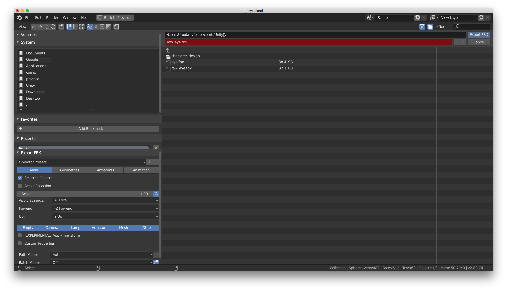
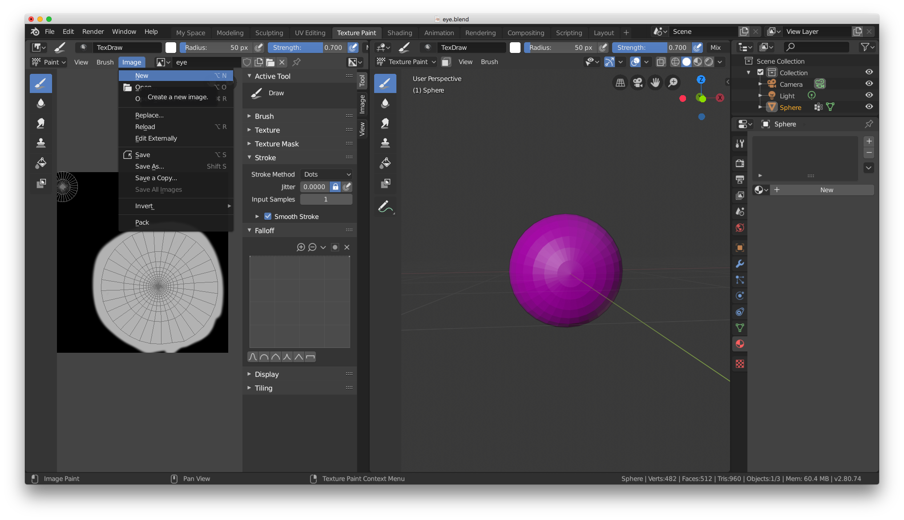
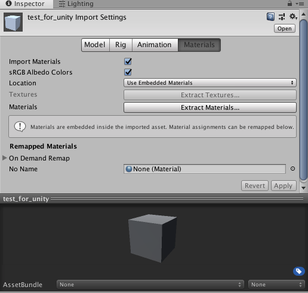

+++
title = "Unity入門 (5) Blenderからのモデルの読み込み"
description = "Blenderで作成したモデルをUnityに読み込む"
date = 2019-07-21T08:44:52Z

[taxonomies]
categories = ["programming"]
tags = ["Unity", "Blender"]
+++

## モチベーション

　Blenderで作成したモデルの読み込みが思ったよりも面倒だったのでメモしておく. 今回はUV展開後にテクスチャ・ペイントで色をつけてテクスチャを作った. アセットを作るときのよくあるワークフローだと思う.

## 前準備

1. テクスチャの作成
2. ペインティング
3. 画像として保存
4. モデルの出力(fbx/obj)

　以上のような処理が必要になります. 大きく分けてメッシュデータとテクスチャ用の画像が必要になるわけです. 今回はBlender側でマテリアルを指定する必要は無いです.

## 書き出しと読み込み

### Blenderによる書き出し(FBX)

　FBX形式は割と簡単です. 出力したいオブジェクトを選択してアプリケーション・メニューバーのFileからExport -\> FBX(.fbx)を選択します. この際Selected Objectsにチェックを入れないとシーン全体が読み込まれてしまいます. 今回は特定のオブジェクトだけを読み込みたいのでこのこのオプションにチェックを入れます.

　テクスチャ画像の方は簡単で, WorkspaceタブのTexture Paintを選択します. メニューからimageを選択してSave As...を選択するかShift + Sで画像を保存します.

### Blenderによる書き出し(.obj)

　FBXの場合と同じでSelected Objectsだけを有効にしておけば, 後はデフォルトで良いと思います.

### Unity

　Unity側で読み込むにはエディタ上にドラッグ・ドロップするだけで良いです. オブジェクトはPrefabのような形式で読み込まれます. そしてインスペクタには読み込んだオブジェクトの設定が表示されているのがわかると思います. 　とりあえずModel, Rig, Animationは無視します. 

　普通にインポートするとマテリアルは埋め込まれた状態になっています. Unity 2017.2からの仕様らしいです. 要するにBlenderなどのマテリアルがそのまま表示されます. 通常これで問題はないと思いますが今回はこれを一度抜き出して, テクスチャを個別に指定しようと思います. 画像にあるExtract Materialsを押すとマテリアルの保存先フォルダを指定するファイル・ブラウザが表示されます. 適当なフォルダを選択し, 別個に出力したテクスチャ画像をAlbedoスロットに指定します. これで自動的にテクスチャがオブジェクトに適用されます. 分離してもこの方法の利点はUnity側でマテリアルを制御できるということです. 反面オリジナルのモデルに変更が出た時に, 差分をきちんとUnity側で指定する必要が出てきそうな気がします.

### マテリアル・システムとは？

　マテリアル・システムはシェーダへの入力をまとめたパラメータ・セットのことです.{{ref(id=1)}} ここに指定した値や画像はシェーダの中で利用されます. 物理ベースマテリアルの場合はシェーダによるレンダリングが物理ベースのモデルが利用されていることからこのように呼ばれるようです. 

> シェーダがレンダリングするときに必要なパラメータで質感などオブジェクトに由来するものをまとめたもの

　マテリアルに指定したパラメータを調節することで比較的簡単に見た目を整えることができます. 特にPBR(Physically Based Rendering)ならリアルな表現を比較的簡単に再現できます.

## Footnote

{{anchor(id=1)}} ただし光源や変換行列などの情報は別個に取得します.

## Reference
+ [Importing](https://docs.unity3d.com/Manual/ImportingAssets.html)
+ [blenderからUnityにマテリアルも付けてエクスポートする方法！](http://bandsite.raindrop.jp/2019/03/16/blender%E3%81%8B%E3%82%89unity%E3%81%AB%E3%83%9E%E3%83%86%E3%83%AA%E3%82%A2%E3%83%AB%E3%82%82%E4%BB%98%E3%81%91%E3%81%A6%E3%82%A8%E3%82%AF%E3%82%B9%E3%83%9D%E3%83%BC%E3%83%88%E3%81%99%E3%82%8B/)
